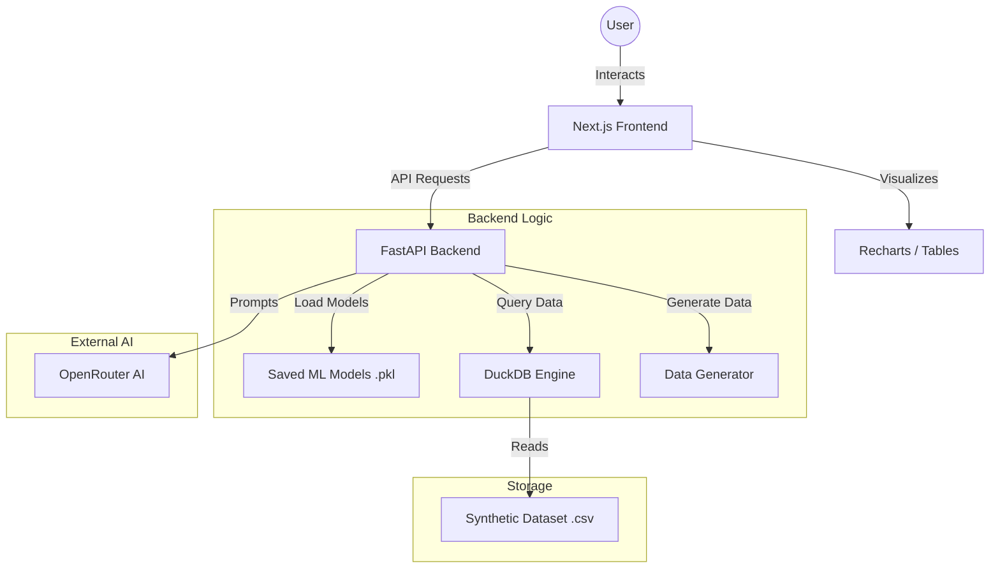

# EdUplift AI: Growth Intelligence System

This project is designed to be a "Decision Support System." It does not just show data; it uses AI to tell you what to do next. It focuses on optimizing revenue and engagement for EdTech platforms by using advanced machine learning and interactive data intelligence.

## Why this Project Exists

In the EdTech industry, companies often struggle with:
1.  **Low Conversion:** Thousands of users sign up, but only a few enroll.
2.  **High Churn:** Students start courses but do not finish them.
3.  **Revenue Leakage:** Highly active users stay on the platform for hours but never buy a premium plan.

EdUplift AI solves these by providing a real-time monitoring system that predicts user behavior and offers actionable business strategies.

---

## Machine Learning Algorithms and Logic

We use two core models to power the system's intelligence:

### 1. Lead Scoring Model (XGBoost)
*   **Algorithm:** XGBoost (Extreme Gradient Boosting).
*   **Why XGBoost?** It is a high-performance tree-based model that excels at handling tabular data with complex relationships. It is much faster and more accurate than traditional logistic regression for behavioral data.
*   **Purpose:** To predict **Enrollment**.
*   **Logic:** It looks at a "Lead" (someone who has not paid yet). If they spend 50+ minutes on the site and view 8+ courses, the model calculates a high probability that they will buy.
*   **Frontend Behavior:** When you click "Calculate Probabilities" in the sidebar, this model generates the Enrollment %. If it is over 70%, it labels the user as "High Priority" for your sales team.

### 2. Churn Prediction Model (Random Forest)
*   **Algorithm:** Random Forest.
*   **Why Random Forest?** It is excellent for classification tasks where understanding feature importance is key. It helps us see exactly which behaviors (like inactivity) lead to a user leaving.
*   **Purpose:** To predict **Retention Risk**.
*   **Logic:** It looks at existing users. If their "Time on Platform" starts dropping or they stop viewing new courses, the model flags them.
*   **Frontend Behavior:** It generates the Churn Risk %. A high percentage means the user is likely to stop using the platform soon.

---

## Advanced Features: OpenRouter and SQL

### Why OpenRouter AI?
We integrated **OpenRouter** (using the Llama 3.1 model) to move beyond simple charts. 
*   **Natural Language to SQL:** Most business owners do not know SQL. OpenRouter converts plain English questions into complex database queries instantly.
*   **AI Analyst:** It acts as a 24/7 business consultant, taking raw data about revenue leakage and writing a professional summary with specific recommendations on how to fix it.

### Why DuckDB and SQL?
*   **Speed:** DuckDB is an analytical database that can run SQL queries directly on CSV files with lightning speed.
*   **Flexibility:** Instead of being limited to pre-made charts, users can ask any question about the data and get a visualized answer immediately.

---

## Frontend Walkthrough (Every Click Explained)

### A. Main Dashboard
*   **Sidebar Inputs (Sliders):** These allow you to "simulate" a user. By moving the sliders, you are sending a request to the AI to see how it would react to that specific behavior.
*   **"Calculate Probabilities" Button:** This sends the slider data to the POST /predict API. The backend runs your saved .pkl models and returns the two percentages you see.
*   **"Refresh Data" (Revenue Leakage):** This calls the GET /revenue-leakage API.
    *   **Why is the Bar Graph constant?** In the backend, the "Leakage" is defined by a fixed rule: Time > 40 minutes AND Revenue == 0. Since the synthetic dataset is generated once and does not change until you regenerate it, the count of users matching this rule stays the same. To see it change, run `python src/utils/data_generator.py` again to create new random data.
*   **"Generate AI Analyst Summary" Button:** This is the OpenRouter integration. It sends the leakage numbers to the AI and asks it to write a business strategy for you.

### B. Project Explanation
*   This is the documentation hub. It explains the flow of the project. It lists the functions (like generate_edtech_data) and the tech stack (Next.js, FastAPI, DuckDB).

### C. Ask Queries About Data
*   **"Ask AI" Box:** This is the most advanced part.
    *   When you type a question like "Who is my best customer?", it does not just search text. It sends your question to OpenRouter, the AI writes a SQL Query, the backend runs that query against the CSV using DuckDB, and the results appear in the table below.
*   **"Suggested Queries":** These are "Quick Shortcuts." Clicking them automatically fills the SQL terminal and runs the report for common business questions.
*   **"SQL Terminal":** This is for power users. You can manually type SQL code here.
*   **Visualization and Result Set:** This area is dynamic. If the query returns categories and numbers, the frontend builds a Bar Chart automatically.

---

## Project Previews

.png)
.png)
.png)
.png)
.png)
.png)
.png)
.png)

---

## Architecture Diagram



---

## Technical Stack

*   **Frontend:** Next.js (App Router), Tailwind CSS, Recharts, Lucide React
*   **Backend:** FastAPI, Uvicorn, Pydantic
*   **AI/ML:** XGBoost, Random Forest, Scikit-learn, OpenRouter (Llama 3.1)
*   **Database:** DuckDB (SQL on CSV)
*   **Data:** Pandas, NumPy, Faker

## Setup and Execution

1.  **Install Dependencies:**
    ```bash
    pip install pandas numpy faker xgboost scikit-learn fastapi uvicorn joblib python-dotenv openai duckdb
    cd frontend
    npm install
    ```

2.  **Configuration:**
    Create a `.env` file in the root directory and add:
    ```
    OPEN_ROUTER_API_KEY=your_key_here
    ```

3.  **Generate Data:**
    ```bash
    python src/utils/data_generator.py
    ```

4.  **Train Models:**
    ```bash
    python src/models/lead_scoring.py
    python src/models/churn_prediction.py
    ```

5.  **Run API:**
    ```bash
    uvicorn src.api.main:app --reload
    ```

6.  **Run Frontend:**
    ```bash
    cd frontend
    npm run dev
    ```
