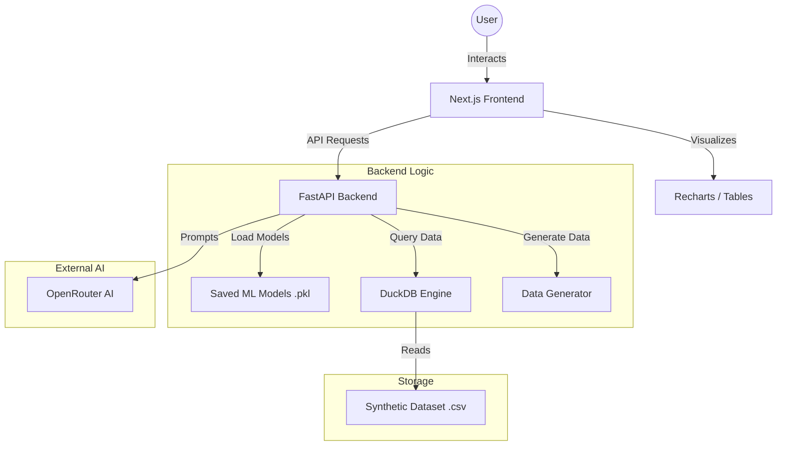

# EdUplift AI: Growth Intelligence System

This project is designed to be a "Decision Support System." It does not just show data; it uses AI to tell you what to do next.

## Project Walkthrough

### 1. The Machine Learning Models (The Brains)
We used two distinct models to handle the user lifecycle:

#### Lead Scoring Model (XGBoost)
*   Purpose: To predict Enrollment.
*   Logic: It looks at a "Lead" (someone who has not paid yet). If they spend 50+ minutes on the site and view 8+ courses, the model calculates a high probability that they will buy.
*   Frontend Behavior: When you click "Calculate Probabilities" in the sidebar, this model generates the Enrollment %. If it is over 70%, it labels the user as "High Priority" for your sales team.

#### Churn Prediction Model (Random Forest)
*   Purpose: To predict Retention Risk.
*   Logic: It looks at existing users. If their "Time on Platform" starts dropping or they stop viewing new courses, the model flags them.
*   Frontend Behavior: It generates the Churn Risk %. A high percentage means the user is likely to stop using the platform soon.

---

### 2. Frontend Walkthrough (Every Click Explained)

#### A. Main Dashboard
*   Sidebar Inputs (Sliders): These allow you to "simulate" a user. By moving the sliders, you are sending a request to the AI to see how it would react to that specific behavior.
*   "Calculate Probabilities" Button: This sends the slider data to the POST /predict API. The backend runs your saved .pkl models and returns the two percentages you see.
*   "Refresh Data" (Revenue Leakage): This calls the GET /revenue-leakage API.
    *   Why is the Bar Graph constant? In the backend, the "Leakage" is defined by a fixed rule: Time > 40 minutes AND Revenue == 0. Since the synthetic dataset is generated once and does not change until you regenerate it, the count of users matching this rule stays the same. To see it change, run `python src/utils/data_generator.py` again to create new random data.
*   "Generate AI Analyst Summary" Button: This is the OpenRouter integration. It sends the leakage numbers to the AI and asks it to write a business strategy for you.

#### B. Project Explanation
*   This is the documentation hub. It explains the flow of the project. It lists the functions (like generate_edtech_data) and the tech stack (Next.js, FastAPI, DuckDB).

#### C. Ask Queries About Data
*   "Ask AI" Box: This is the most advanced part.
    *   When you type a question like "Who is my best customer?", it does not just search text. It sends your question to OpenRouter, the AI writes a SQL Query, the backend runs that query against the CSV using DuckDB, and the results appear in the table below.
*   "Suggested Queries": These are "Quick Shortcuts." Clicking them automatically fills the SQL terminal and runs the report for common business questions.
*   "SQL Terminal": This is for power users. You can manually type SQL code here.
*   Visualization and Result Set: This area is dynamic. If the query returns categories and numbers, the frontend builds a Bar Chart automatically.

### Summary of What is Happening Where
*   Left Sidebar: Navigation between the three tools (Dashboard, Info, SQL).
*   Top Right (Dashboard): Real-time AI simulation for testing individual users.
*   Bottom Right (Dashboard): Strategic AI for analyzing your whole business.
*   Query Page: Deep data exploration for asking specific questions.

---

## Architecture Diagram



---

## Demo Pictures


---

## Technical Stack

*   Frontend: Next.js (App Router), Tailwind CSS, Recharts, Lucide React
*   Backend: FastAPI, Uvicorn, Pydantic
*   AI/ML: XGBoost, Random Forest, Scikit-learn, OpenRouter (Llama 3.1)
*   Database: DuckDB (SQL on CSV)
*   Data: Pandas, NumPy, Faker

## Setup and Execution

1.  **Install Dependencies:**
    ```bash
    pip install pandas numpy faker xgboost scikit-learn fastapi uvicorn joblib python-dotenv openai duckdb
    cd frontend
    npm install
    ```

2.  **Configuration:**
    Create a `.env` file in the root directory and add:
    ```
    OPEN_ROUTER_API_KEY=your_key_here
    ```

3.  **Generate Data:**
    ```bash
    python src/utils/data_generator.py
    ```

4.  **Train Models:**
    ```bash
    python src/models/lead_scoring.py
    python src/models/churn_prediction.py
    ```

5.  **Run API:**
    ```bash
    uvicorn src.api.main:app --reload
    ```

6.  **Run Frontend:**
    ```bash
    cd frontend
    npm run dev
    ```
